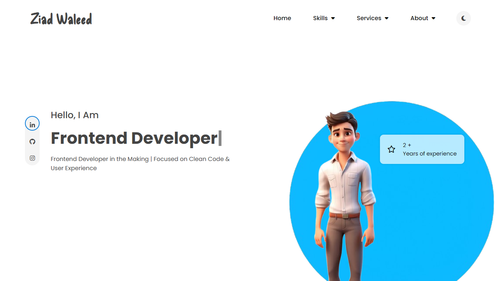
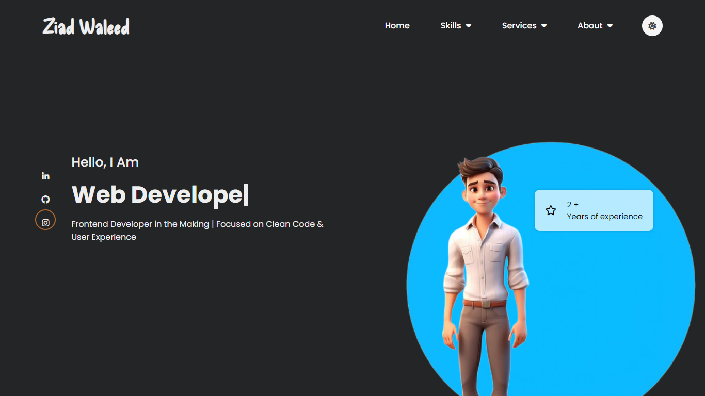

# Ziad Waleed | Portfolio Website

A responsive and interactive personal portfolio website for **Ziad Waleed**, built using HTML, CSS, and JavaScript.  
The project features a modern design, a light/dark mode toggle, animated elements, and responsive modals for small screens.

## 📂 Project Structure

- `index.html` — Main HTML file with all sections (Hero, Skills, Services, About).
- `assets/css/style.css` — Styling for layout, responsiveness, dark mode, animations, and modals.
- `assets/js/main.js` — JavaScript for interactivity (dark mode, menu toggle, modals handling).
- `assets/img/` — Folder for images (profile photo, decorative elements like circles).

## ✨ Features

- **Responsive Design** — Fully adaptable for all devices (desktop, tablet, mobile).
- **Dark Mode Toggle** — Seamlessly switch between light and dark themes.
- **Animated Hero Section** — Typing effect for dynamic job titles using `Typed.js`.
- **Interactive Modals** — Skills, Services, and About Me sections appear as modals on small devices.
- **Smooth Navigation** — Responsive navbar with hamburger menu on smaller screens.
- **Social Media Links** — LinkedIn, GitHub, and Instagram icons.
- **Modern UI/UX** — Clean, minimalistic, and user-focused design.

## 🚀 Technologies Used

- **HTML5** — Markup structure
- **CSS3** — Custom styles with media queries for responsiveness
- **JavaScript** — DOM interactions, events handling, responsive behavior
- **FontAwesome** — For icons
- **Typed.js** — Typing animation effect

## 📸 Screenshots

| Light Mode | Dark Mode |
|------------|-----------|
|  |  |
